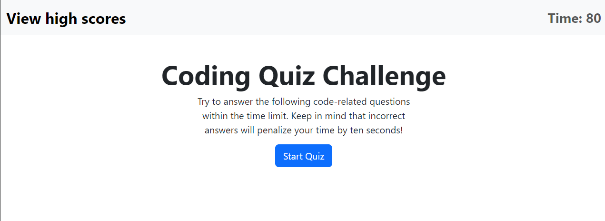

# Code Quiz

## Project Description

This project is a simple quiz application that tests the user's knowledge. The quiz is timed and the user's score is based on the time remaining when the quiz is completed. The user is also able to save their score to a high score list. The project is built using HTML, CSS, and JavaScript.

## Features

The project features a simple and clean user interface. The user is able to start the quiz, view the high score list, and add their own score to the list. The high score list is also saved into the local storage. The project also features a timer that counts down from 60 seconds. The user's score is based on both the amount of questions answered correctly and time remaining when the quiz is completed.

See below for a screenshot of the project.

## Deployment

The project is deployed at the following URL: [Code Quiz](https://aaronh-o.github.io/code-quiz/)
